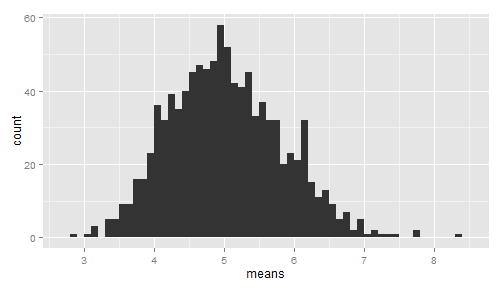
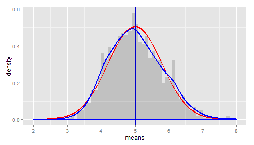

# Statistical Inference Course Project (Simulation_runs)
# By Shirlene Paul


## Overview
In this project we will investigate the exponential distribution in R and compare it with the Central Limit Theorem. The exponential distribution can be simulated in R with rexp(n, lambda) where lambda is the rate parameter. The mean of exponential distribution is 1/lambda and the standard deviation is also 1/lambda. The lambda = 0.2 for all of the simulations as mentioned in Coursera course porject. I will investigate the distribution of averages of 40 exponentials. Note : However I will be performing 1000 simulation runs.

## Simulations


```r
# load neccesary libraries for plotting
library(ggplot2)

# set constants as mentioned
lambda <- 0.2 # lambda for rexp
n <- 40 # number of exponetials
numberOfSimulations <- 1000 # number of tests

# set the seed to create reproducability
set.seed(11081979)

# run the test resulting in n x numberOfSimulations matrix
exponentialDistributions <- matrix(data=rexp(n * numberOfSimulations, lambda), nrow=numberOfSimulations)
exponentialDistributionMeans <- data.frame(means=apply(exponentialDistributions, 1, mean))
```

 

## Sample Mean versus Theoretical Mean

The expected mean $\mu$ of a exponential distribution of rate $\lambda$ is 

$\mu= \frac{1}{\lambda}$ 


```r
mu <- 1/lambda
mu
```

```
## [1] 5
```

Let $\bar X$ be the average sample mean of 1000 simulations of 40 randomly sampled exponential distributions.


```r
meanOfMeans <- mean(exponentialDistributionMeans$means)
meanOfMeans
```

```
## [1] 5.027126
```

As you can see the expected mean and the avarage sample mean are very close 

## Sample Variance versus Theoretical Variance

The expected standard deviation $\sigma$ of a exponential distribution of rate $\lambda$ is 

$\sigma = \frac{1/\lambda}{\sqrt{n}}$ 

The e


```r
sd <- 1/lambda/sqrt(n)
sd
```

```
## [1] 0.7905694
```

The variance $Var$ of standard deviation $\sigma$ is

$Var = \sigma^2$ 


```r
Var <- sd^2
Var
```

```
## [1] 0.625
```

Let $Var_x$ be the variance of the average sample mean of 1000 simulations of 40 randomly sampled exponential distribution, and $\sigma_x$ the corresponding standard deviation.

```r
sd_x <- sd(exponentialDistributionMeans$means)
sd_x
```

```
## [1] 0.8020334
```

```r
Var_x <- var(exponentialDistributionMeans$means)
Var_x
```

```
## [1] 0.6432577
```

As you can see the standard deviations are very close
Since variance is the square of the standard deviations, minor differnces will we enhanced, but are still pretty close.

## Distribution

Comparing the population means & standard deviation with a normal distribution of the expected values. Added lines for the calculated and expected means

 

As you can see from the graph, the calculated distribution of means of random sampled exponantial distributions, overlaps quite nice with the normal distribution with the expected values based on the given lamba


